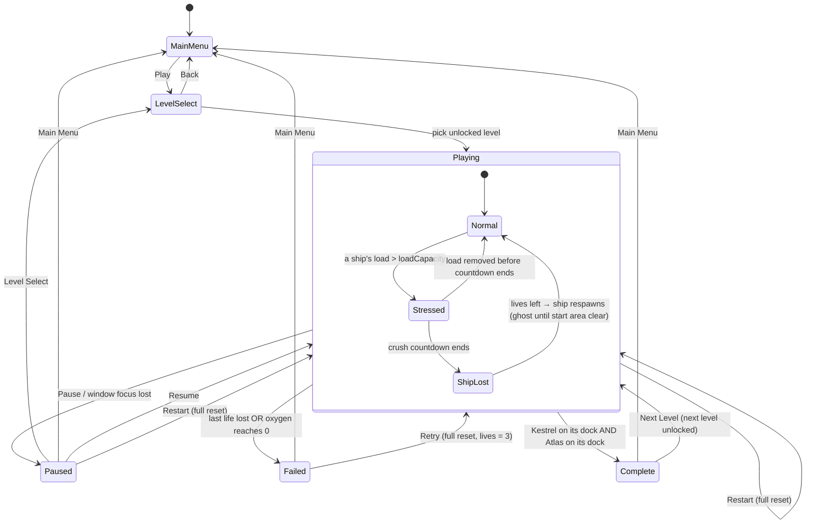
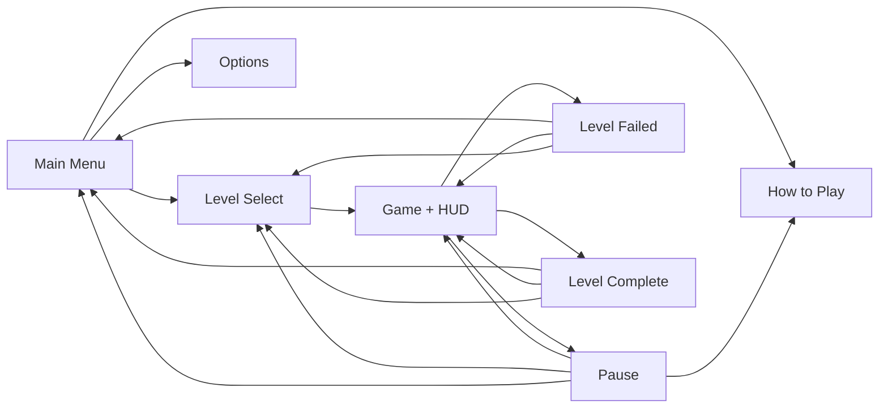
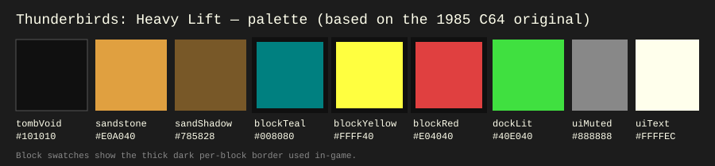
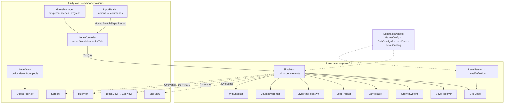

# Game Design Document — *Thunderbirds: Remake*

| |                                                                                  |
|---|----------------------------------------------------------------------------------|
| **Working title** | Thunderbirds: Remake                                                        |
| **Team** | Ofri Kuperberg, Rotem Saraf
| **Genre** | Real-time 2D puzzle / two-ship rescue                                            |
| **Target platform** | PC (Windows x64) standalone build; Android build as polish                       |
| **Engine / Unity version** | Unity 6 (6000.3.20f1), URP 2D Renderer                                           |
| **Orientation & reference resolution** | Landscape 16:9, 1920 × 1080 reference; levels are one screen of ~32 × 18 cells   |
| **Expected session length** | 1–4 minutes per level; ~20 minutes for all MVP levels                            |
| **Document version** | v0.1 — 2026-09-14                                                                |

---

## 1. High Concept

A level-based rescue puzzle game. Each level is a side-view tomb maze. You pilot two rescue spaceships — the nimble *Kestrel* and the heavy-lifter *Atlas* — switching between them in real time. Each can reach places or move obstacles the other can't, so they must clear the way for each other. Dock both ships before the trapped scientists' oxygen runs out.

### Design pillars

1. **Weight is the only rule** — every push and lift is decided by *the full weight you would move* vs. that ship's capacity, and block colour is derived from weight. The floor carries a block until a ship tries to move it. *Rules out:* special-case blocks, per-colour exceptions, "unpushable" flags, Unity physics mass.
2. **Real-time, never turn-based** — gravity and oxygen never wait for the player; the grid is an internal model, not a turn structure. *Rules out:* undo, input locks while blocks settle, a planning preview that is on by default.
3. **Two ships, one pilot** — no level can be finished with one ship. Kestrel is fast and fits narrow gaps; Atlas is slow and moves heavy weight. *Rules out:* single-ship levels, AI-controlled companions, single-ship modes.

---

## 2. Reference & Inspiration


- **Primary reference:** *Thunderbirds* (Firebird, 1985, Commodore 64) — [Game of the Week article with the ZZAP!64 review](https://gb64.com/oldsite/gameofweek/9/gotw_thunderbirds.htm).
  **Taking:** two craft controlled one at a time with a switch button; coloured blocks that only a specific craft can move; passages too narrow for the big craft; the craft having to co-operate to clear a path; rescuing trapped scientists against a running clock.
  **Not taking / doing differently:** top-down view (we are **side-view with gravity**); one connected flip-screen tomb (we use **separate single-screen levels**); the equipment loadout screen and points-per-ton economy; fuel (replaced by **oxygen**); save/load of a game position (replaced by **Restart** and **lives**).
- **Secondary reference:** *Boulder Dash* — real-time play on a logical grid with blocks that fall on their own. We take the "grid rules, continuous feel" model.
- **Video:** [C64 Thunderbirds gameplay (from 0:58)](https://youtu.be/l7JSYmzShfg?t=58) — the two craft taking turns to shift coloured slabs through the tomb against the clock.
- **What the screenshot shows us:** the sandstone-and-black palette and coloured slabs directly inspire our tomb look and teal / yellow / red block classes (our teal replaces the original's light blue); the E–F fuel gauge and timer become our single **oxygen bar**; the score panel is dropped (no score in the MVP).

---

## 3. Core Game Loop



*Leaving a level from Pause, Failed or Complete discards the level state (no mid-level saving); only unlock progress is kept.*

**Moment-to-moment rules** — the things that are true every frame:

**Ships & movement**
- **Kestrel is 2 × 2 cells, Atlas is 4 × 2 cells.** Ships **ignore gravity** — they hover wherever they stop. Ships cannot be pushed; to blocks and to each other they are obstacles like walls.
- Only the **active** ship moves; the other holds position. `SwitchShip` works instantly at any time, including while a ship is stressed.
- On every switch — manual, or automatic when a ship becomes a ghost — the newly active ship **pulses bright white for `switchHighlightSeconds`**. The pulse never hides the ship (it brightens, not on/off), so it can't be confused with the ghost blink or hide the ship during danger, and the player can move it immediately.
- Holding a direction moves one cell per step. **The logical position changes the moment a step starts; the sprite then slides there.** Steps chain back-to-back, so a held direction reads as one continuous glide. Atlas steps every `atlasMoveStepSeconds`; Kestrel every `atlasMoveStepSeconds / kestrelSpeedRatio`.

**Blocks**
- A block is a **rigid shape of cells of any form** (L-shapes included), defined in the level file. **Weight = number of cells.** Blocks never merge, tip or rotate, and each keeps its own clear outline.
- **Colour class:** **Teal** — weight ≤ Kestrel's `pushCapacity`; **Yellow** — weight ≤ Atlas's `pushCapacity`; **Red** — heavier than Atlas can move. A single block may not be authored red (the level validator rejects it); red appears only when a group is too heavy for any ship.
- A block is **supported if any of its bottom cells rests on something** (wall, block or ship). An unsupported block falls one cell per `fallStepSeconds`, taking whatever rests only on it along.

**Push** — moving sideways into blocks in front of the ship
- The chain is every block that would be displaced, plus everything riding on those blocks. If the chain's full weight > the ship's `pushCapacity`, or the front of the chain is blocked, the move is **refused**: the ship bumps and the chain flashes its colour class.

**Lift** — moving up with blocks on the roof
- Lift weight is **everything that would rise, at full weight — even if part of it also rests on a ledge**. If lift weight > `loadCapacity`, or the top of the stack would hit a ceiling, the move is **refused** (bump + flash). A refused lift is never fatal.

**Carrying**
- A block is **Carried by a ship** when everything it rests on is that ship, or blocks already carried by that ship. This covers blocks the ship lifted, blocks that fell onto it, and blocks left on it when another supporter moved away.
- A block resting on things *not* all belonging to one carrier (e.g. a ledge and Kestrel; or a Kestrel-carried block and an Atlas-carried block) is **Resting**: if a ship moves away, it slides out from under the block and the block stays. (There is no pull function.)
- Carried blocks travel with their ship in all four directions. Supports underneath never release a carried block — **only an obstacle in its path does:**

| Ship moves | Carried block runs into something | Result |
|---|---|---|
| Up | a ceiling above the block | move **refused** — the ship would have to pass through its own load |
| Sideways | a wall in the block's path | block **released**: it stays, the ship slides out from under it |
| Down | a floor/ledge under the block | block **released**: it is set down, the ship descends away |

*Example — using walls as leverage:* Kestrel carries an L-block and lowers its leg into a slot between two walls, then flies right. The leg hits the wall, the whole block is released, and Kestrel is free.

```
1. carry to slot         2. move down            3. move right
. . . L L L L L .        . . . . . . . . .       . . . . . . . . .
. . . L . K K . .        . . . L L L L L .       . . . L L L L L .
. . . L . K K . .        . . . L . K K . .       . . . L . . K K .
. . # . # . . . .        . . # L # K K . .       . . # L # . K K .
. . # . # . . . .        . . # . # . . . .       . . # . # . . . .
```

**Load, crush & lives**
- A ship's **load** is the full weight of every block it carries (including everything stacked on them). A block also held by anything static adds no load. Exception: a block resting only on the two ships (carried by neither) counts fully toward **both** ships' loads.
- If load > `loadCapacity` (e.g. something fell onto a carried stack), the ship is **Stressed**: it shakes, flashes red, and a countdown ring of `crushGraceSeconds` appears above it. Removing the load in time (scraping it off against a wall, or switching ships and pushing it away) resets the countdown.
- When the countdown ends, the ship is **crushed**: its carried blocks are released and it loses one of the level's **3 lives**. Only that ship respawns at its start cell; the rest of the level stays as it is. If its start area is occupied, it waits as a **blinking ghost** (not solid, not selectable), control switches to the other ship, and it materialises once the area is clear.
- Losing the **last life** fails the level.

**Order within each simulation tick** (fixed, so results are always the same)
1. **Gravity** — blocks due to fall move one cell. *(Falls win ties: a block falling into a cell a ship is entering on the same tick gets the cell, and the ship's move is refused.)*
2. **Ship move** — push / lift / carry / release.
3. **Carry states** updated.
4. **Loads & crush countdowns** start, reset or tick.
5. **Crushes** — lose a life, ship becomes a ghost; ghosts whose start area is clear materialise.
6. **Oxygen** ticks down.
7. **Failure check** — no lives left, or oxygen = 0. **Failure is checked before success.**
8. **Success check** — both ships on their docks.

- **Scoring:** none in the MVP. Completing a level unlocks the next (saved in `PlayerPrefs`).
- **Failure:** out of lives ("CRUSHED") or out of oxygen ("OUT OF OXYGEN"). The simulation freezes, the Failed screen appears after 0.5 s, and Retry performs a full reset (lives = 3, oxygen refilled). `Restart` does the same at any time.

### Parameters you will need to tune

| Parameter | Lives in | What it controls | First guess |
|---|---|---|---|
| `atlasMoveStepSeconds` | `GameConfig` | Atlas's time per cell — the reference ship speed | 0.16 |
| `kestrelSpeedRatio` | `GameConfig` | Kestrel speed ÷ Atlas speed (1 = same, 2 = Kestrel twice as fast, 0.5 = Atlas twice as fast) | 2 |
| `fallStepSeconds` | `GameConfig` | Time per cell of falling — **check together with ship speeds**: it decides which ship can outrun a falling block | 0.10 |
| `pushCapacity` | `ShipConfig` (Kestrel / Atlas) | Max chain weight the ship can push — also sets the colour thresholds | 4 / 8 |
| `loadCapacity` | `ShipConfig` (Kestrel / Atlas) | Max weight the ship can lift and carry before being stressed | 4 / 8 |
| `crushGraceSeconds` | `GameConfig` | Time to save a stressed ship — **verify first** that a switch-ships-and-push rescue fits | 3.0 |
| `livesPerLevel` | `GameConfig` | Crushes allowed before the level fails | 3 |
| `defaultTimeLimitSeconds` | `GameConfig` | Oxygen when a level doesn't set its own | 90 |
| `timeLimitSeconds` | `LevelData` | Oxygen for this level (0 = use default) | per level |
| `restartHoldSeconds` | `GameConfig` | Hold time before `Restart` triggers | 0.5 |
| `switchHighlightSeconds` | `GameConfig` | How long the newly active ship pulses after a switch | 1.5 |
| `shipTiltDegrees` / `hoverBobAmplitude` | `GameConfig` | How alive ships look while moving / hovering | 8° / 0.05 u |
| `showPushPreview` | `GameConfig` + Options | Warning tint before moves *(polish, default off)* | false |

**Where these live:** a `GameConfig` ScriptableObject, two `ShipConfig` ScriptableObjects, and one `LevelData` asset per level — all editable in the Inspector without recompiling.

**Feel target:** a first-time player finishes L1 within 60 s after reading How to Play; holding a direction for 1 s moves Kestrel ~12 cells with no visible stop between cells; in L4 a player who reacts within 2 s can save a stressed ship.

---

## 4. Controls & Input

All gameplay goes through an Input System **Action Map**; gameplay code only knows action names, never keys.

| Action | Keyboard | Gamepad | Touch *(polish, Android)* |
|---|---|---|---|
| `Move` (held, 4 directions) | WASD / Arrow keys | Left stick / D-pad | On-screen D-pad |
| `SwitchShip` | Space / Tab | South button (A / ✕) | [Switch] button |
| `Restart` (hold) | R | View / Select | [↻] button |
| `Pause` | Esc | Menu / Start | [II] button |

Menus use the standard UI actions (`Navigate`, `Submit`, `Cancel`) so mouse, keyboard and gamepad all work.

- `Move` is **read as held**: whenever the active ship is ready for its next step, it moves in the currently held direction. A tap shorter than one step still produces one step. On diagonal input, the most recently pressed axis wins.
- `Restart` requires holding for `restartHoldSeconds` (with a fill ring), so a panicked mis-press during a crush countdown can't wipe a nearly-solved level. Implemented as an Input System `Hold` interaction.
- `Pause` freezes the simulation (no oxygen drain, no falls, no crush countdowns). **Losing window focus auto-pauses.**
- On the Failed and Complete screens, gameplay actions are disabled and buttons ignore input for **0.5 s**, so a held `Move` or `SwitchShip` can't press "Next" by accident.
- On-screen button hints show the **current device's binding** (e.g. "Space" vs "Ⓐ").

---

## 5. Screens & UI



```
HUD layout (1920 × 1080)
┌────────────────────────────────────────────────────────────┐
│ O₂ ▓▓▓▓▓▓▓▓░░░ 54s                     [Kestrel] ⇄ Space   │
│ ♥ ♥ ♥                                                      │
│                                                            │
│                 ( ◔ )  ← crush ring above a stressed ship  │
│                 [ K K ]                                    │
│            level grid, letterboxed to fit                  │
└────────────────────────────────────────────────────────────┘
```

1. **Main Menu** — title *Thunderbirds: Heavy Lift*; buttons **Play**, **How to Play**, **Options**, **Quit**.
2. **Level Select** — tiles L1–L5: locked (padlock), unlocked, completed (✓); **Back**.
3. **How to Play** — reachable from Main Menu and Pause. Covers: controls (current device bindings); Kestrel vs Atlas (size, speed, capacities — **read live from `ShipConfig`** so the text never goes stale); what teal / yellow / red mean; carrying and release (the slot example); crush countdown; lives; oxygen. **Back** returns to where it was opened.
4. **Game HUD** — top-left: oxygen bar + seconds (turns red under 15 s) and 3 life icons; top-right: active ship portrait + `SwitchShip` hint. In the world: highlight outline on the active ship, plus a bright pulse right after each switch; countdown ring above a stressed ship; blinking ghost for a waiting respawn. At level start: a short hint banner from `LevelData.hintText`.
   **Deliberately absent:** weight numbers on blocks — weight is read from colour, and faint cell seams let the player count cells. Also absent: score and minimap.
5. **Pause** — **Resume**, **Restart**, **How to Play**, **Options**, **Level Select**, **Main Menu**. Leaving the level asks no confirmation in the MVP (levels are short); a "Leave level?" confirm is polish if playtests show accidental exits.
6. **Level Failed** — headline **"CRUSHED"** or **"OUT OF OXYGEN"**; **Retry**, **Level Select**, **Main Menu**.
7. **Level Complete** — **"RESCUE COMPLETE"**, oxygen remaining; **Next Level**, **Level Select**, **Main Menu**.
8. **Options** — fullscreen toggle (MVP); music & SFX volume and the push-preview toggle arrive with their polish features.

- **Canvas setup:** Screen Space – Overlay, CanvasScaler *Scale With Screen Size*, reference 1920 × 1080, match = 0.5.
- **Camera:** orthographic, sized per level to fit the whole grid with letterboxing on any aspect ratio. It never scrolls.

---

## 6. Art & Audio

**Art direction:** a dark sandstone tomb with bright, readable rescue craft. We use outside sprites but never depend on a sprite made for a specific shape: **every block is built from one cell sprite**. Each cell checks its four neighbours for "part of my block?" and draws a thick dark border only on the sides where it isn't (plus a corner piece where a shape bends inward). Two touching yellow blocks therefore show a clear double line between them; one big yellow block shows only faint seams.

**Palette** — sampled from the C64 original (§2) so the remake reads as its descendant; the one deliberate change is teal for light blocks. Teal is the darkest block colour, so its cell seams are drawn light (white at low opacity) rather than dark. These exact values are the defaults for the colour fields in `GameConfig`.



| Token | Hex | Use |
|---|---|---|
| `tombVoid` | `#101010` | Corridors / background behind the maze |
| `sandstone` | `#E0A040` | Wall and floor tiles |
| `sandShadow` | `#785828` | Tile speckle, wall edges, block borders on light tiles |
| `blockTeal` | `#008080` | Blocks any ship can move (team choice, replacing the original's light blue `#A0A0FF`) |
| `blockYellow` | `#FFFF40` | Blocks only Atlas can move |
| `blockRed` | `#E04040` | Chain flash when a group is too heavy for any ship; stress flash |
| `dockLit` | `#40E040` | Dock pads when their ship is docked |
| `uiMuted` | `#888888` | Locked levels, inactive HUD elements |
| `uiText` | `#FFFFEC` | HUD and menu text, switch-highlight pulse |

Colour is never the only cue: a block's class can also be read by counting its cell seams (weight vs. the capacities on the How to Play screen), red appears only as a flash on a refused move, and the Failed screen names the reason in text.

| Asset | Variants / frames | Source & licence | Use |
|---|---|---|---|
| Block cell | 1 plain, borderless, near-white tile — tinted per colour class | CC0 tile — chosen with the final art style | All blocks, any shape |
| Block border & inner-corner pieces | 1 edge strip + 1 corner | Made by team | Per-block outlines |
| Wall / floor tiles | 3–4 sandstone variants | CC0 tile pack — chosen with the final art style | Level geometry |
| Kestrel, Atlas | 1 body + thruster frames each | CC0 ship pack — chosen with the final art style (candidates below) | Ships |
| Dock pads | 2 sizes (2 × 2, 4 × 2) + lit state | Made by team | Win targets |
| UI font | Orbitron | Google Fonts, SIL OFL | All UI |
| SFX — step hum, bump, land, release, stress creak, crush, dock, switch, UI click | 1–2 each | Kenney audio packs (CC0) / generated with jsfxr | *Polish* |
| Music — menu + level loop | 1 each | Free Thunderbirds-*style* track, CC0 / CC-BY (credited); possibly our own composition | *Polish* |

**Licence note:** all listed assets are CC0, OFL, or made by us, and may be used in the submission and a public build (CC-BY tracks will be credited in the menu). We do **not** use the original *Thunderbirds* theme — the composition is copyrighted, so even free recordings of it are off-limits. "Thunderbirds" is a trademark (ITV); the title is acceptable for a private university project, but a public release would be renamed (e.g. *Heavy Lift: Tomb Rescue*). The ship names Kestrel and Atlas are ours.

**Final art pack — decided after GDD approval.** The design does not depend on specific sprites, only on these requirements:
- **CC0 (or OFL/CC-BY with credit) only**, licence file kept next to the assets in `Assets/Art/`.
- **Ship silhouettes fit their footprints** without stretching: Kestrel ≈ square (2 × 2), Atlas ≈ twice as wide as tall (4 × 2), readable at the in-game size.
- **Ships must not be red-dominant**, so the red stress and "too heavy" flashes stay visible.
- **One consistent style** for ships, tiles, blocks and docks — no mixing pixel art with vector art.
- **Block cell tile is plain, borderless and near-white**, so tinting gives true teal / yellow / red and one block of many cells reads as a single piece.

Candidates under review: *Kenney Space Shooter Extension* (vector, CC0 — licence file checked; Kestrel `spaceShips_003`, Atlas `spaceRockets_002` lying flat) and *Void – Fleet Pack 2 (Nairan)* by Baldur, distributed by Foozle (pixel art, CC0 — licence file checked; Kestrel = Scout/Fighter, Atlas = Torpedo Ship).

**Technical art rules:** sorting layers back → front: `Background → Walls → Docks → Blocks → Ships → Effects → UI`; one SpriteAtlas; URP 2D Renderer; 1 grid cell = 1 world unit. Import settings follow the chosen style — vector: Bilinear filtering, PPU 64; pixel art: Point (no filter), PPU = art pixels per cell, Pixel Perfect Camera, every sprite on the same pixel scale.

---

## 7. Technical Design

**Scenes:** `MainMenu.unity` (Main Menu, Level Select, How to Play, Options) and `Game.unity` (loads the chosen `LevelData`; HUD and Pause / Failed / Complete overlays). Restart, respawn and Next Level **never reload the scene** — they rebuild the rules model and reuse pooled views.

**Packages / systems used:** Input System 1.19, URP 17.3 (2D Renderer), 2D Sprite, UGUI + TextMeshPro, Unity Test Framework (Edit Mode). Deliberately not used: Tilemap (levels are generated from text), Rigidbody2D (rules are grid-based), tween libraries (own coroutines).

**Target device:** the instructor's machine (unknown) — therefore a Windows x64 standalone build that is resolution- and aspect-independent and works with keyboard or gamepad.

**Architecture:** two layers. The **Rules layer** is plain C# with no Unity scene dependency and is unit-tested; the **Unity layer** reads it, animates it, and feeds it input.



| Script | Responsibility |
|---|---|
| `GameManager` | Singleton that survives scene loads: selected level, unlocked levels, scene changes |
| `LevelController` | Creates the `Simulation` for a level, calls `Tick(dt)` each frame, pauses/resumes |
| `InputReader` | Converts Input System actions into gameplay commands |
| `LevelView` | Builds wall, block and dock visuals from pools when a level is built or rebuilt |
| `ShipView` | Slides, tilts and bobs a ship toward its model position; switch pulse; stress shake; ghost blink |
| `BlockView` / `CellView` | Draws a block from pooled cells; each cell picks its border sides from a neighbour mask |
| `HudView` | Oxygen bar, lives, active-ship portrait, stress countdown rings |
| `ObjectPool<T>` | Generic get/release pool for cells, tiles and particles |
| `Simulation` | Runs the rule systems in the fixed tick order and raises events — holds no rules itself |
| `GridModel` | Live level state: what occupies each cell; `SupportsOf(block)` query |
| `MoveResolver` | Validates and applies a ship move: push chain, lift, carried group, release |
| `GravitySystem` | Moves unsupported blocks down one cell when their fall step is due |
| `CarryTracker` | Updates each block's `CarriedBy` from its supports |
| `LoadTracker` | Computes ship loads; starts, resets and ticks crush countdowns |
| `LivesAndRespawn` | Lives count, ghost state, materialising when the start area is clear |
| `CountdownTimer` | Reusable timer with `Tick(dt)` and an `Expired` event (oxygen, crush) |
| `WinChecker` | Are both ships on their docks? |
| `LevelParser` | Text grid → validated, immutable `LevelDefinition`, with readable error messages |

**Level format.** Each `LevelData` asset holds a multi-line text grid; one character = one cell. The immutable `LevelDefinition` it parses into is kept for respawns and full resets; the live `GridModel` is rebuilt from it.

```
################################
#..............................#
#..........................cccc#
#......bbb.................cccc#
#KK....b...................AAAA#
#KK...######...............AAAA#
#11...#....#............dd.2222#
#11...#....#............d..2222#
################################
```
*(`b` = 4-cell L resting on a ledge — teal; `c` = 8-cell block carried by Atlas — yellow; `d` = 3-cell L on the floor — teal.)*

**Why text, not scene-built or Tilemap levels:** (1) a block is "every cell with the same letter", which gives arbitrary rigid shapes and their weight directly — a Tilemap knows only tiles, not which tiles form one block; (2) the rules layer and its Edit Mode tests parse levels without loading a scene, so every level can be validated by a test; (3) `.unity` files can't be merged, so scene-built levels would let only the scene owner design them — text diffs cleanly and both teammates can author levels; (4) Restart and respawn rebuild the grid from the immutable `LevelDefinition` without a scene reload; (5) the polish level editor only has to write the same format. The cost — no visual editing — is covered by readable parser errors and the Inspector grid preview (polish #11).

| Char | Meaning | Validation |
|---|---|---|
| `#` / `.` | wall / empty | — |
| `K` / `A` | Kestrel (2 × 2) / Atlas (4 × 2) start | exactly one ship each, exact rectangle |
| `1` / `2` | Kestrel dock (2 × 2) / Atlas dock (4 × 2) | exactly one each, exact size |
| `a`–`z` | a block — all cells with the same letter form one block | connected shape; weight ≤ Atlas `pushCapacity` (no authored red blocks) |

**Simulation events — the contract between the layers:** `ShipMoved`, `MoveRefused`, `BlockMoved`, `BlockFell`, `BlockLanded`, `BlockReleased`, `ShipStressed`, `ShipRelieved`, `ShipCrushed`, `ShipRespawned`, `ActiveShipChanged`, `OxygenChanged`, `LevelComplete`, `LevelFailed(reason)`. A full input → tick → events → views trace of one move is in [`move-flow.md`](move-flow.md).

**Team workflow:** both teammates work across every layer — each milestone gives each person rules-layer, view/UI and level-design issues — so both can explain any file. Only **scene ownership** is fixed, because `.unity` files cannot be merged: Ofri owns `Game.unity`, Rotem owns `MainMenu.unity`, and anything the non-owner needs in a scene arrives as a prefab. The event contract above is agreed in a day-one pair session, together with a fake simulation, so views can be built before the rules exist. Every PR is reviewed by the other person. After each tested feature: bump `bundleVersion`, update this GDD if rules changed, commit. Full rules — binding for humans and AI assistants, and enforced by `tools/check-rules.ps1` and CI — are in [`COLLABORATION.md`](COLLABORATION.md). Work is tracked as GitHub issues #1–#27 under milestones *M1 - Playable core* (26 Sep) and *M2 - MVP complete* (4 Oct).

### The course features we are implementing

1. **Object pooling** — `CellView`s, wall tiles and (polish) particles. A level has several hundred cells, and Restart / Next Level / full reset rebuild all of them; pooling keeps that instant and avoids GC spikes, because a dropped frame during a 3-second crush countdown is an unfair death.
2. **Singleton** — `GameManager` (and `AudioManager` in polish) only: they own state that must survive scene loads. Rules classes are deliberately *not* singletons, so every test and every restart gets a clean instance with no leftover state.
3. **Coroutines** — timed *presentation*: step slides, fall slides, switch pulse, stress shake, ghost blink, level-complete sequence, launch intro (polish). Timed *rules* (oxygen, crush) use `CountdownTimer` inside the model so they are testable and cannot outlive a restart.
4. **ScriptableObjects** — `GameConfig`, `ShipConfig` × 2, `LevelData` per level, `LevelCatalog`: every tuning parameter is Inspector-editable without recompiling, and the shared configs rebalance all levels at once.
5. **Observer (C# events)** — the `Simulation` announces what happened; views, HUD and feedback listen. The rules never reference a view, which is what lets the "look & sound great" polish be added without touching rule code.
6. **State machines** — game flow (Menu → Playing → Paused / Failed / Complete), block state (Resting / Falling / Carried), ship state (Normal / Stressed / Ghost).
7. **Input System action maps** — device-independent controls, and the path to Android touch buttons without gameplay changes.
8. **Building for platforms** — Windows standalone in the MVP; Android in polish.

---

## 8. Scope

### 8.1 MVP — the game is not a game without these

- [ ] `MainMenu` and `Game` scenes; Main Menu, Level Select (unlocking, `PlayerPrefs`), How to Play (from menu and pause), Options (fullscreen), Pause, Failed, Complete
- [ ] Kestrel 2 × 2 and Atlas 4 × 2; instant switching with a highlight pulse on the new active ship; `kestrelSpeedRatio`
- [ ] Held-direction grid movement with smooth back-to-back steps, tilt and hover bob
- [ ] Blocks of any rigid shape from the text grid; weight = cells; teal / yellow / red classes; one-sprite cells with clear per-block borders
- [ ] Push chains, lift, Carried state, release on obstacles, falls-first gravity
- [ ] Load, Stressed state (shake, red flash, world-space countdown ring), crush
- [ ] 3 lives per level, ghost respawn at start cell, level failure on last life
- [ ] Oxygen per level; full reset when it runs out
- [ ] Win when both ships are docked
- [ ] Hold-to-Restart, Pause, auto-pause on focus loss, 0.5 s end-screen lockout
- [ ] `LevelParser` with validation; Edit Mode tests for every rule above, plus a test that validates all levels
- [ ] 5 levels, one idea each: L1 move / switch / dock · L2 push capacity · L3 lift & carry · L4 falls & crush · L5 everything under tight oxygen
- [ ] Keyboard and gamepad; Windows build; aspect-independent camera
- [ ] Kenney ship and tile sprites integrated

### 8.2 Polish — if the MVP is done and playable *(priority order)*

1. [ ] **Look & sound** — SFX, free Thunderbirds-style music, dust/spark particles, crush camera shake, landing squash, launch intro, 2D spotlights on the ships in a dark tomb, volume sliders
2. [ ] Android build with on-screen controls
3. [ ] Levels 6–10
4. [ ] In-game "Make your own level" editor (writes the same text format)
5. [ ] Equipment pickups (Mole, Thunderbird 4, …) that give a ship a new ability
6. [ ] Scientist pod — a carried block that must reach an exit as an extra win goal
7. [ ] Pressure plates and doors
8. [ ] Push / load warning preview with wind-up delay (toggle in `GameConfig` and Options)
9. [ ] Pull / grab a block that isn't carried
10. [ ] Our own composed music
11. [ ] Inspector grid preview for `LevelData`

### 8.3 Explicitly out of scope — we are **not** building these

- A connected flip-screen tomb, and with it the original's "can't switch ships from an adjacent screen" rule
- Undo — this is a real-time game; Restart and lives cover mistakes
- Tipping, rotating or seesaw blocks — blocks are rigid and never rotate
- Unity physics for game rules (Rigidbody2D) and free, off-grid movement
- The original's equipment loadout screen, weight/points economy and fuel (oxygen replaces fuel)
- Score, leaderboards, online services, multiplayer
- Saving mid-level — only level-unlock progress is saved
- iOS, console and WebGL builds
- The real *Thunderbirds* theme music or any assets from the show

---

## Changelog

| Version | Date | Change |
|---|---|---|
| v0.1 | 2026-09-14 | Initial draft: concept, rules, controls, screens, art, architecture and scope agreed in design session |
| v0.1.1 | 2026-09-24 | §7: rationale for text-based levels; one-move sequence diagram added in [`move-flow.md`](move-flow.md) |
