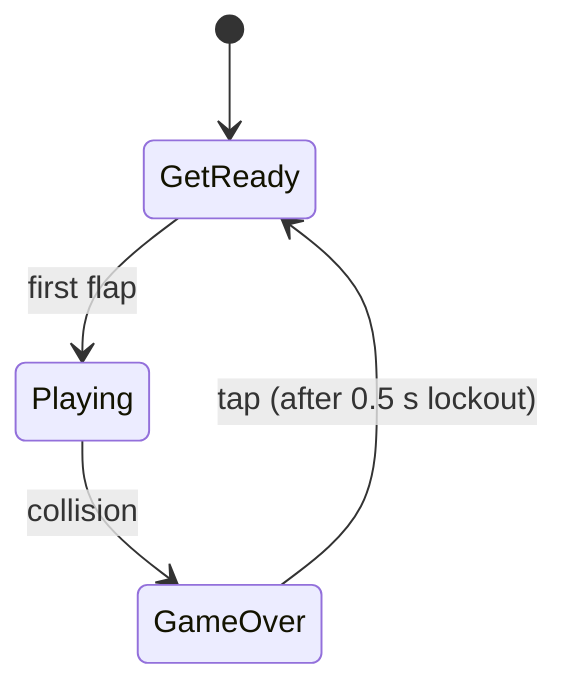
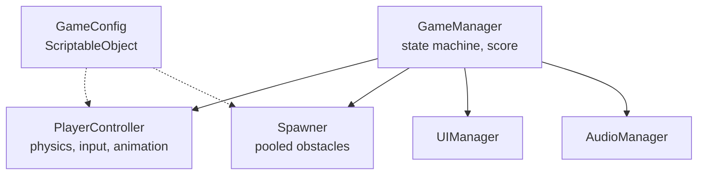

# Game Design Document — *<Your Game Title>*

> **How to use this template**
> Copy this file into your own repository as `Docs/GDD.md`. Fill in every section.
> **Delete every quoted guidance block like this one before you submit** — they are scaffolding, not content.
> Each section shows a ✗ and a ✓ example, both about the same game (a Flappy Bird clone), so you can see
> exactly what the difference in quality looks like on identical subject matter.
> Target length for the finished document: **2–5 pages**. Grading: [`RUBRIC.md`](RUBRIC.md).

| | |
|---|---|
| **Working title** | |
| **Team** | Name (role), Name (role) |
| **Genre** | e.g. Arcade / endless obstacle-dodger / one-button score-chaser |
| **Target platform** | e.g. PC (Windows) + macOS, standalone build |
| **Engine / Unity version** | e.g. Unity 6 (6000.3.12f1), URP, 2D |
| **Orientation & reference resolution** | e.g. Portrait, 288 × 512 reference |
| **Expected session length** | e.g. 10 seconds – 5 minutes |
| **Document version** | v0.1 — YYYY-MM-DD |

---

## 1. High Concept

> **What this section is for:** the whole game, in the time it takes to read a tweet. If a reader stops
> here, they should still be able to picture the game running. **Hard limit: 60 words.**
>
> ✗ *"A fun and addictive arcade game with challenging gameplay where the player has to avoid obstacles
> and get a high score. It will be very polished and juicy."*
> — This describes roughly nine thousand games. It contains no decisions.
>
> ✓ *"The player controls a bird that falls constantly under gravity. One input — tap, click, or space —
> replaces its vertical velocity with a fixed upward impulse. The world scrolls left at a constant speed
> past an endless run of pipe pairs with a fixed gap at random heights. Clear a gap, +1. Touch anything, die.
> Restart takes under two seconds."*
> — 60 words, and a programmer could start building from it.

_<Your high concept here — 60 words max.>_

### Design pillars

> **What this section is for:** three short statements you will use to settle arguments later. A pillar is
> useful only if it can **reject** a feature. "Fun" rejects nothing and is therefore not a pillar.
>
> ✗ *"Fun, polished, replayable."*
> ✓ *"**Absolute fairness** — fixed gap size, no difficulty ramp, deterministic physics. Every death is the
> player's fault and must feel like it. (This is why there are no power-ups and no random wind gusts.)"*

1. **<Pillar>** — <what it means, and what it rules out>
2. **<Pillar>** — <…>
3. **<Pillar>** — <…>

---

## 2. Reference & Inspiration

> **What this section is for:** do not make me imagine it. Show me. Screenshots, a link to a video of the
> game you are cloning or riffing on, a mood board, a competitor. One clearly-labelled image here saves a
> page of prose. State explicitly what you are taking and what you are deliberately doing differently.


- **Primary reference:** <name + link>. Taking: <…>. Not taking: <…>.
- **Video:** <link to 30 s of footage that shows the feel you are after>

---

## 3. Core Game Loop

> **What this section is for:** the shape of a single play session, start to finish, including how it ends
> and how it begins again. **A diagram is required here.** On GitHub you can write one directly in Markdown
> with a ` ```mermaid ` block (see below) — no image file needed, and it stays diff-able in git.
>
> ✗ *"The player plays the game, and if they lose, they can play again."*
> ✓ The diagram below plus 4–8 bullets of moment-to-moment rules.



**Moment-to-moment rules** — the things that are true every frame:

> ✗ *"The bird jumps when you press space and falls down because of gravity."*
> ✓ *"A flap **replaces** vertical velocity with `+5.0 u/s` — it never adds to it. This is the single most
> important line in the document: adding makes rapid tapping fly you off the top of the screen, and the
> game stops being Flappy Bird."*

- <Rule — write the ones a programmer would otherwise have to guess at>
- <Rule>
- **Scoring:** <exactly when the score increments, and what triggers it>
- **Failure:** <exactly what kills the player, and what happens in the 2 seconds after>

### Parameters you will need to tune

> **What this section is for:** you will not get the feel right on the first attempt. Nobody does — the
> Flappy Bird clone in the worked example had its gravity and jump strength changed after the very first
> playtest. What you *can* decide now is **which knobs you will need to turn**, and make sure every one of
> them is reachable from the Inspector rather than buried in a script.
>
> List them. You do not need units, and you do not need to be right — put a first guess in, or leave it
> blank. The point is that when the game feels wrong in week three, you already know what to reach for.
>
> ✗ *"We will tune the jump until it feels good."*
> — Tune *what*, exactly? This sentence commits to nothing and reaches for nothing.
>
> ✓ *the table below — named knobs, each with what it controls and a slot for a first guess.*

| Parameter | What it controls | First guess |
|---|---|---|
| `jumpStrength` | How high a single tap lifts the player | |
| `gravity` | How fast the player falls back down — trades against `jumpStrength`; changing one always means re-checking the other | |
| `scrollSpeed` | How fast the world moves past the player — the main difficulty dial | |
| `gapSize` | How much room there is to fly through | |
| _<your parameter>_ | | |

**Where these live:** <e.g. "a `GameConfig` ScriptableObject", or "`[SerializeField]` fields on
`PlayerController`" — anywhere that does not require a recompile to change>

**Feel target:** <one testable sentence, e.g. "a first-time player scores at least 1 point within five
attempts; someone who has played for ten minutes reaches 10+">

---

## 4. Controls & Input

> **What this section is for:** the full input surface, per platform, including the cases that bite —
> input during menus, input during the death animation, focus loss.
>
> ✗ *"Space to jump."*
> ✓ the table plus the three rules below it.

| Action | Keyboard / Mouse | Gamepad | Touch |
|---|---|---|---|
| <Action> | | | |

- Input is read on **press** in `Update`, buffered, and applied in `FixedUpdate` — so no input is ever dropped between physics steps.
- <What happens if the player presses the action while a UI button is under the cursor?>
- <What happens on the game-over screen? Is there an input lockout, and how long?>

---

## 5. Screens & UI

> **What this section is for:** an inventory of every screen, and what is on each one. A sketch — even a
> photograph of a whiteboard — is worth more than the prose. Say what is **not** on the HUD, too.
>
> ✗ *"There will be a main menu, a game screen, and a game over screen."*
> ✓ a numbered inventory where each entry lists its actual elements, plus a layout image.


1. **<Screen name>** — <elements: exact text, buttons, what each button does>
2. **<Screen name>** — <…>

- **HUD during play:** <exactly what is on screen, and what is deliberately absent>
- **Canvas setup:** <e.g. Screen Space – Camera, CanvasScaler *Scale With Screen Size*, reference 288 × 512, match = 1>

---

## 6. Art & Audio

> **What this section is for:** what assets exist, where they came from, and — critically — **under what
> licence**. "I found it on Google Images" is not a licence. If you are using someone else's assets for
> a private learning build, say so explicitly and say what you would swap them for in a public release.
>
> ✗ *"Retro pixel art style with classic sound effects."*
> ✓ a manifest table + an explicit licence paragraph.

| Asset | Variants / frames | Source & licence | Use |
|---|---|---|---|
| <Player sprite> | 3 colours × 3 frames | <source>, <licence> | |
| <SFX> | | | |

**Licence note:** <state plainly what you may and may not do with these assets, and what the plan is for
a public build.>

**Technical art rules:** <e.g. Point (no filter) import, PPU 100, single SpriteAtlas, sorting layers back→front: background → obstacles → ground → player → UI>

---

## 7. Technical Design

> **What this section is for:** how it is actually built. Enough that a programmer could lay out the scene
> and the scripts before writing any logic. A component diagram is worth more than a wall of text.
>
> ✗ *"We will use Unity's physics and some scripts."*
> ✓ the breakdown below.

**Scenes:** <how many, named, and why — e.g. "one scene, `Game.unity`; restart reloads it">

**Packages / systems used:** <e.g. Input System, Physics2D, URP 2D renderer>

**Target device:** <the actual machine you will demo on>

**Architecture:**



| Script | Responsibility |
|---|---|
| `<Name>` | <one line — if it takes two, the class is doing too much> |

### The course features you are implementing

> Name them, and say **where** in the game each one appears and **why it is the right tool there**.
> "We will use object pooling" is not an answer. "Pipe pairs are pooled — six live instances recycled —
> because instantiating during play causes GC spikes that cost frames, and a dropped frame in a
> one-input timing game is an unfair death" is an answer.

1. **<Feature>** — <where, and why>
2. **<Feature>** — <where, and why>

---

## 8. Scope

> **What this section is for:** the most important section in the document, and the one students skip.
> Three lists. The third one is the one that saves your project.
>
> ✗ *"We'll implement the core game first and then add more features if we have time."*
> ✓ three explicit lists, with the third one being genuinely painful to write.

### 8.1 MVP — the game is not a game without these

- [ ] <…>

### 8.2 Polish — if the MVP is done and playable

- [ ] <…>

### 8.3 Explicitly out of scope — we are **not** building these

> Minimum four entries. Be specific, and be ruthless. Every entry here is an argument you will not have
> to have with yourself at 2 a.m. in week five.

- <e.g. Multiplayer / leaderboards / any online service>
- <e.g. Difficulty ramping, power-ups, multiple game modes>
- <e.g. A save system beyond a single `PlayerPrefs` high score>
- <e.g. Mobile builds>

---

## Changelog

> Every time the design changes, add a line. This is how I can see that the document was actually used.

| Version | Date | Change |
|---|---|---|
| v0.1 | YYYY-MM-DD | Initial draft |
