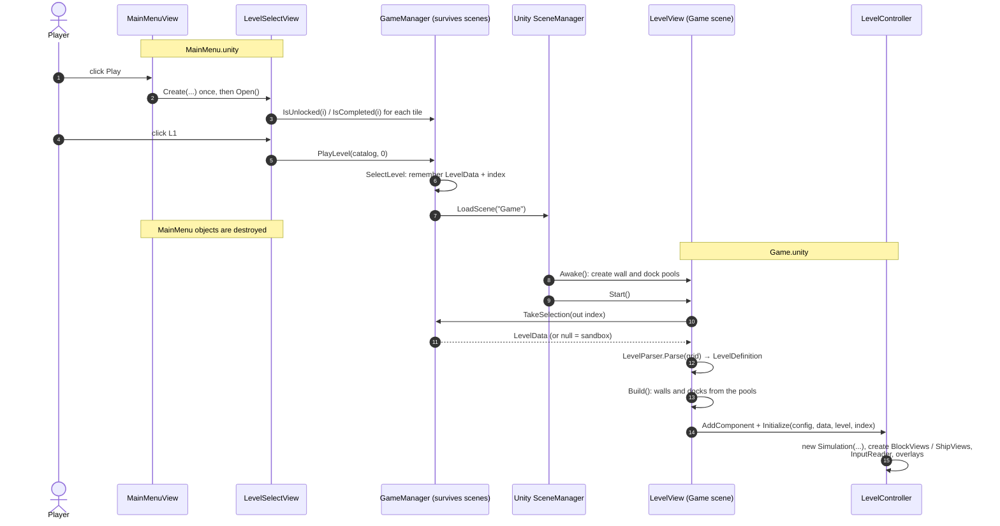
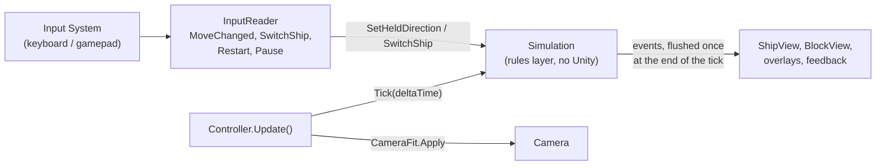
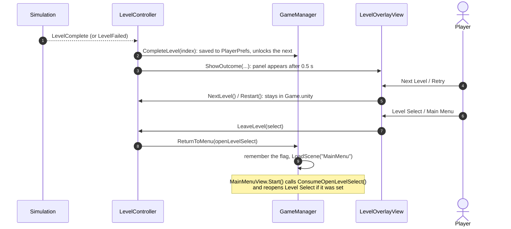
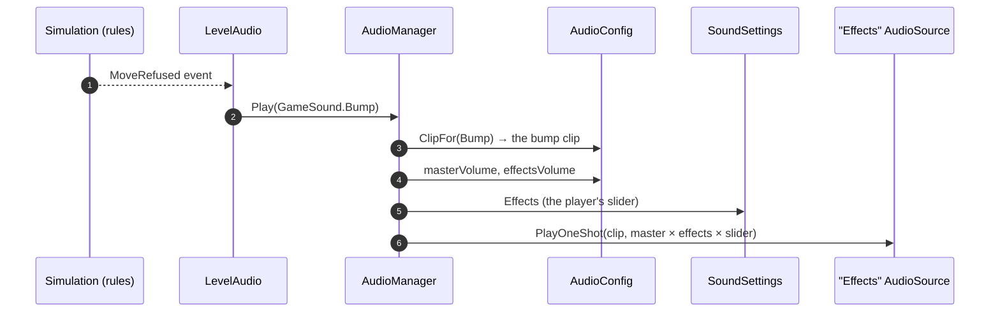
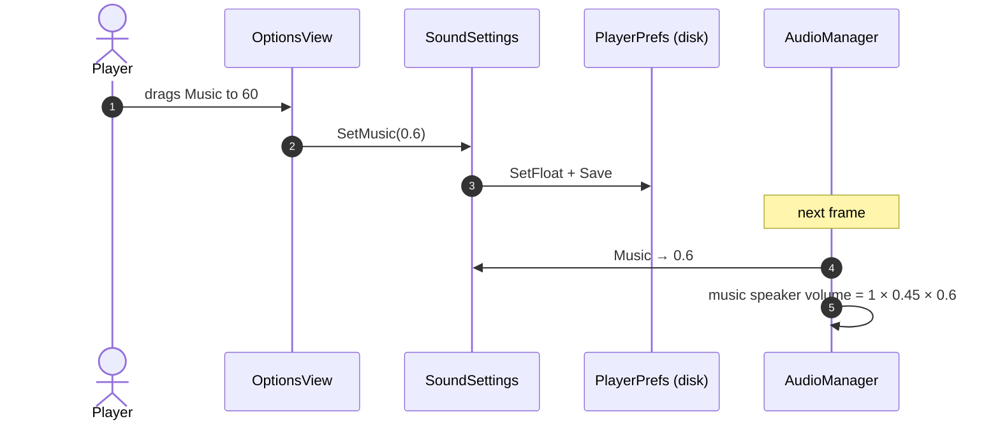

# Game Flow: From the Menu to a Running Level

How the code gets from "player clicks L1" to a level on screen, what runs every frame, how a level
ends, and how sound works ([section 5](#5-sound)). For what happens inside **one move**, see
[`move-flow.md`](move-flow.md). For the rules themselves, see [GDD §3](GDD.md#3-core-game-loop).

> Describes the code as of issue #18 (`GameManager`, and `LevelController`, which was called
> `SandboxPreviewController` before).

## The short answer

`LevelSelectView` never calls `LevelView`, and it cannot: they live in **different scenes**. When the Game
scene loads, every object of the MainMenu scene is destroyed, including `LevelSelectView`.

The only thing that survives is **`GameManager`** (a `DontDestroyOnLoad` singleton). So the handoff is:

1. `LevelSelectView` tells `GameManager` which level was chosen, and `GameManager` loads the Game scene.
2. Unity creates the Game scene. `LevelView` is an object in that scene, so Unity calls its `Start()`.
3. `LevelView.Start()` asks `GameManager` "which level?" and builds it.

Nobody calls `LevelView`. **Unity** does, because the scene it belongs to was loaded.

## 1. Menu to level



Notes:

- **Sandbox button:** `GameManager.PlaySandbox()` clears the selection and loads the same scene.
  `TakeSelection` then returns null, and `LevelView` falls back to its `previewLevel` (L0_Sandbox).
- **`TakeSelection` hands the level over once.** A second call returns null. This stops a stale selection
  from leaking into a later scene load.
- **A locked or missing level is refused** inside `SelectLevel`, so no caller can skip the unlock rule.

## 2. Every frame while playing

`LevelController.Update()` is the heartbeat. The rules never run on their own; the controller
ticks them.



Inside one `Simulation.Tick`, the steps always run in the same order (GDD §3):

| # | Step | Class |
|---|---|---|
| 1 | Gravity: unsupported blocks fall one cell | `GravitySystem` |
| 2 | The active ship moves: push, lift, carry, release | `MoveResolver` |
| 3 | Which blocks are carried | `CarryTracker` |
| 4 | Ship loads and crush countdowns | `LoadTracker` |
| 5 | Crushes cost a life; ghosts respawn | `LivesAndRespawn` |
| 6 | Oxygen ticks down | `CountdownTimer` |
| 7 | Failure check (no lives, or no oxygen) | `Simulation` |
| 8 | Success check (both ships docked) | `WinChecker` |

Then the events are sent. Views only listen (`ShipMoved`, `ShipCrushed`, `LevelComplete`, ...) and animate.
They never decide whether something is allowed. That is collaboration rule R7.

## 3. Restart, respawn and Next Level: no scene load

None of these go through `GameManager`, and none reload the scene.

| Action | What happens |
|---|---|
| **Respawn** after a crush | Inside the rules (step 5). The ship's position changes; `ShipView` hears `ShipRespawned` and snaps there. |
| **Restart** / **Retry** | `Simulation.Restart()` builds a fresh state from the same `LevelDefinition`. The controller rebinds the existing ship and block views to the new state. |
| **Next Level** | The controller takes the next `LevelData` from the catalog, parses it, calls `LevelView.Build()` (walls and docks return to their pools and are reused), then restarts. |

This is why object pooling matters here: a rebuild creates no new GameObjects once the pools are warm.

## 4. A level ends



`CompleteLevel` is only called for campaign levels (index ≥ 0), so the sandbox never changes progress.

## 5. Sound

Four small pieces, each with one job:

| Piece | File | Its job |
|---|---|---|
| `AudioConfig` | `Assets/Scripts/Unity/Config/AudioConfig.cs`, asset at `Assets/Resources/AudioConfig.asset` | **What** to play: every clip and the designer's volumes. Data only, no logic. |
| `LevelAudio` | `Assets/Scripts/Unity/Audio/LevelAudio.cs` | **When** to play: turns what happens in a level into "play this sound". Plain C#. |
| `AudioManager` | `Assets/Scripts/Unity/Audio/AudioManager.cs` | **How** to play: owns Unity's `AudioSource`s and makes the actual sound. Singleton. |
| `SoundSettings` | `Assets/Scripts/Unity/Audio/SoundSettings.cs` | **How loud the player wants it**: the two Options sliders, saved on the computer. |

Two Unity words used below:

- An **`AudioClip`** is a sound file (the `.ogg` and `.wav` files under `Assets/Audio`).
- An **`AudioSource`** is a speaker. It plays a clip at a volume between 0 and 1. A looping source can only
  play one clip at a time, which is why the manager has several.

### 5.1 The game starts: who starts the music

Nothing in a scene starts the music, and no scene contains the `AudioManager`. Unity is told to call it:

1. `AudioManager.StartWithTheGame()` carries the attribute
   `[RuntimeInitializeOnLoadMethod(AfterSceneLoad)]`. Unity calls every method with that attribute once,
   right after the first scene has loaded, whichever scene that is.
2. It reads `AudioManager.Instance`. Nobody has made the manager yet, so the `Instance` getter makes it:
   a new GameObject, the `AudioManager` component on it, `DontDestroyOnLoad` so scene changes do not
   destroy it, and then `Initialise(...)`.
3. `Initialise` loads the `AudioConfig` asset by name with `Resources.Load` and creates the five speakers
   as child objects: **Music**, **Effects**, **Overload**, **Kestrel engine**, **Atlas engine**. The four
   looping ones get their clip here.
4. `PlayMusic()` sets the music speaker's volume and presses play.

From then on, anything that reads `AudioManager.Instance` gets that same object. Because it survives scene
loads, the music does not restart between the menu and a level.

### 5.2 A level starts: who connects the sounds

`LevelController.Initialize` creates one `LevelAudio` for the level:

```csharp
var sound = AudioManager.Instance;
_audio = new LevelAudio(sound, () => State, _simulation.Events, sound.IdleEngineLevel);
```

The four arguments are everything `LevelAudio` knows about the world:

| Argument | Meaning |
|---|---|
| `sound` | Where to send "play this". Typed as `IGameAudio`, not `AudioManager` (see 5.6). |
| `() => State` | A function that returns the current rules state. A function, not the state itself, because Restart replaces the state object with a new one. |
| `_simulation.Events` | The rules' events, to subscribe to. |
| `IdleEngineLevel` | How loud a hovering engine is, as a fraction of a flying one (from `AudioConfig`). |

The controller then calls `_audio.Update(...)` every frame, `_audio.Reset()` on Restart, and
`_audio.Dispose()` when the level is left.

### 5.3 One sound from start to finish

Kestrel flies into a wall:



`LevelAudio` never touches a clip or a speaker. `AudioManager` never knows why a sound was asked for.

### 5.4 The methods of each piece

**`LevelAudio`** decides, and asks.

| Method | What it does |
|---|---|
| Constructor | Stores the four arguments and subscribes to six rules events. Then calls `Reset()`. |
| `OnMoveRefused`, `OnActiveShipChanged`, `OnShipCrushed`, `OnLevelComplete`, `OnLevelFailed` | One line each: an event arrived, ask for its sound (`Bump`, `SwitchShip`, `Crush`, `LevelComplete`, `GameOver`). |
| `OnShipMoved` | Plays nothing. It starts a short timer for that ship: "this ship is flying for the next step and a half". |
| `Update(dt, paused)` | Called every frame. For each ship it does the three things below, then switches the overload alarm on or off. |
| `Reset()` | Level start and Restart. Clears the timers and notes which ships already sit on their dock, so they do not chime. |
| `Dispose()` | Leaving the level. Unsubscribes from the events, sets both engines to 0 and the alarm off, so nothing keeps sounding in the menu. |

What `Update` does for each ship:

1. **Engine.** Counts the flying timer down. Then picks a level: `0` if the game is paused, over, or the
   ship is a ghost; `1` if the timer is still running (flying); otherwise the idle level (hovering). It
   sends that with `SetEngineLevel`.
2. **Overload.** Remembers whether this ship is stressed (carrying more than it can).
3. **Dock chime.** The rules have no "docked" event, so `LevelAudio` keeps a set of the ships that are
   docked. A ship on its dock that was **not** in the set a frame ago has just arrived: chime once and add
   it. A ship off its dock is removed, so it can chime again next time.

The flying timer is 1.5 steps long on purpose: when the player holds a direction, the next `ShipMoved`
arrives before the timer runs out, so the engine stays at full level instead of dipping between steps.

**`AudioManager`** obeys, and owns the speakers.

| Method | What it does |
|---|---|
| `Instance` (getter) | Returns the manager, creating it the first time (5.1). |
| `Initialise(config)` | Creates the five speakers and gives the looping ones their clip. With no config it warns once and the game is silent. |
| `NewSource(name, loop)` | Makes one speaker: a child object with an `AudioSource`, 2D, not playing, volume 0. |
| `PlayMusic()` | Sets the music volume and starts the loop, unless it is already playing. |
| `Play(sound)` | Finds the clip with `ClipFor` and plays it once on the Effects speaker. |
| `ClipFor(sound)` | A `switch` from the `GameSound` name to the clip field in `AudioConfig`. |
| `SetEngineLevel(ship, level)` | Only **stores** the wanted level (0..1) for that ship. No sound changes here. |
| `SetOverloadAlarm(on)` | Starts or stops the alarm loop, and does nothing if it is already in that state. |
| `Update()` | Unity calls it every frame. Sets the music volume, and moves each engine's volume a small step toward its stored level, starting or stopping the speaker as needed. This is the fade. |
| `MusicVolume`, `EffectsVolume`, `EngineVolume` | The volume sums (5.5). Computed fresh every time they are read. |
| `ResetInstance()` | Destroys the manager when Play mode starts in the editor and between tests, so no old copy is left over. |
| `Awake` / `OnDestroy` | Safety: a second copy destroys itself; the stored instance is cleared when the real one dies. |

`Play` uses `PlayOneShot`, which lets many effects overlap on one speaker (a bump during the level-complete
jingle does not cut it off). The engines and the alarm are loops, so each needs its own speaker.

**`SoundSettings`** remembers the player's two numbers.

| Member | What it does |
|---|---|
| `Music`, `Effects` | 0..1. The first read loads the value from `PlayerPrefs` (0.75 if the player never moved the slider) and keeps it in memory; later reads use the kept value. |
| `SetMusic(v)`, `SetEffects(v)` | Clamp to 0..1, keep in memory, and write to `PlayerPrefs` at once. |
| `Reload()` | Forgets the kept values so the next read loads from `PlayerPrefs` again. |

`PlayerPrefs` is Unity's small key-value store on the player's computer. It is what makes the sliders
survive closing the game.

**`OptionsView`** (the sliders).

| Method | What it does |
|---|---|
| `ShowSavedVolumes()` | When the panel opens: puts each slider where the saved setting is. It uses `SetValueWithoutNotify`, so this does not count as the player moving it. |
| `UpdateMusic(value)`, `UpdateEffects(value)` | Called by the slider when the player moves it. Converts the slider's 0..100 to 0..1, calls `SoundSettings.SetMusic` / `SetEffects`, and updates the "60%" label. |

### 5.5 Volume: who sets it

Every volume is three numbers multiplied. Each is between 0 and 1, so each can only make the sound quieter:

```text
volume = masterVolume  ×  category volume  ×  the player's slider
         (AudioConfig)    (AudioConfig)       (SoundSettings)
```

| Sound | Category volume | Slider | With the default values |
|---|---|---|---|
| Music | `musicVolume` 0.45 | Music | 1 × 0.45 × 0.75 = **0.34** |
| Effects, overload alarm | `effectsVolume` 0.8 | Effects | 1 × 0.8 × 0.75 = **0.60** |
| Engine, flying | `engineVolume` 0.3 | Effects | 1 × 0.3 × 0.75 = **0.23** |
| Engine, hovering | the flying volume × `idleEngineLevel` 0.25 | Effects | 0.23 × 0.25 = **0.06** |

Who sets each number:

- **The designer** sets the `AudioConfig` numbers in the editor (**Thunderbirds → Open Game Settings →
  Sound settings**). They are the mix: how loud music is compared with effects.
- **The player** sets the slider in Options. It scales the designer's mix and never replaces it.

When each kind of sound gets its volume:

- **Music:** when it starts, and again every frame in `AudioManager.Update`. That is why moving the Music
  slider is heard at once.
- **A one-shot effect:** once, at the moment `Play` is called. A sound already playing keeps the volume it
  started with.
- **Engines:** every frame, moving toward `level × EngineVolume`. A full fade takes `engineFadeSeconds`.
- **Overload alarm:** when it starts, and every frame while it plays.

So the game "knows" the starting volume like this: the first time anything asks for `MusicVolume`, the
manager reads two numbers from the `AudioConfig` asset and one from `SoundSettings`, which loads it from
`PlayerPrefs`. No volume is stored anywhere else.

The slider, end to end:



`OptionsView` never talks to `AudioManager`. It only changes the setting; the manager notices on its own
because it reads the setting every frame.

### 5.6 Why `LevelAudio` talks to an interface

`IGameAudio` (top of `LevelAudio.cs`) is a list of the three things `LevelAudio` needs: `Play`,
`SetEngineLevel`, `SetOverloadAlarm`. `AudioManager` implements it. In `LevelAudioTests` a fake implements
it and writes down what was asked for, so "the dock chimes once, not every frame" is tested without a
sound device. `SoundSettingsTests` cover the real manager: that its speakers can be heard and that the
sliders are saved.

### 5.7 Changing a sound

1. Put the new file in `Assets/Audio/Sfx` (or `Music`) and let Unity import it, so it gets a `.meta`.
2. Open **Thunderbirds → Open Game Settings → Sound settings** and drag it into the slot.
3. Add its source and licence to `Assets/Audio/SOURCE.md`.

An empty slot is simply silent. A new *kind* of sound needs a new `GameSound` value, a clip field in
`AudioConfig`, a `case` in `ClipFor`, and a line in `LevelAudio` that asks for it.

## Who owns what

| Thing | Owner | Lives |
|---|---|---|
| Which level was chosen; "reopen Level Select" flag; every `LoadScene` | `GameManager` | Across scenes |
| Unlock progress on disk | `LevelProgress` (PlayerPrefs), reached through `GameManager` | Across runs of the game |
| Walls and dock pads | `LevelView` + `ObjectPool` | Game scene |
| The rules state (ships, blocks, lives, oxygen) | `Simulation` | One level attempt; rebuilt on Restart |
| Ticking the rules, input wiring, block and ship views | `LevelController` | Game scene |
| Pause / Failed / Complete panels | `LevelOverlayView` | Game scene |
| Camera size and position | `CameraFit` (called by the controller each frame) | Game scene |
| The speakers (`AudioSource`s) and the music | `AudioManager` | Across scenes |
| Which sound plays when, in a level | `LevelAudio` (created by the controller) | One level; reset on Restart |
| Clips and the designer's volumes | `AudioConfig` asset in `Resources` | In the project |
| The player's volume sliders | `SoundSettings` (PlayerPrefs) | Across runs of the game |

## Where to look when something breaks

| Symptom | Start here |
|---|---|
| Wrong level loads, or the sandbox loads instead | `GameManager.SelectLevel` / `TakeSelection`, then `LevelView.Start` |
| A level tile is locked or unlocked wrongly | `LevelProgress.IsUnlocked`, `LevelSelectView.Open` |
| A move is refused or allowed wrongly | `MoveResolver` (rules), never a view |
| A sprite is in the wrong place | The view that listens to that event (`ShipView`, `BlockView`) |
| Something is left over after Restart | `LevelController.Restart`, `Simulation.Restart` |
| The level is cut off or tiny on some screen | `CameraFit.OrthographicSize` |
| A sound plays at the wrong moment, or not when it should | `LevelAudio` (the event handler, or `Update`) |
| The right sound is asked for but nothing is heard | `AudioManager.Play` / `ClipFor`, the slot in `AudioConfig`, then the clip itself |
| Everything is too loud or too quiet | `AudioConfig` volumes; the Options sliders (`SoundSettings`) |
| The game is completely silent | Console warning "No AudioConfig at Resources/AudioConfig" |
