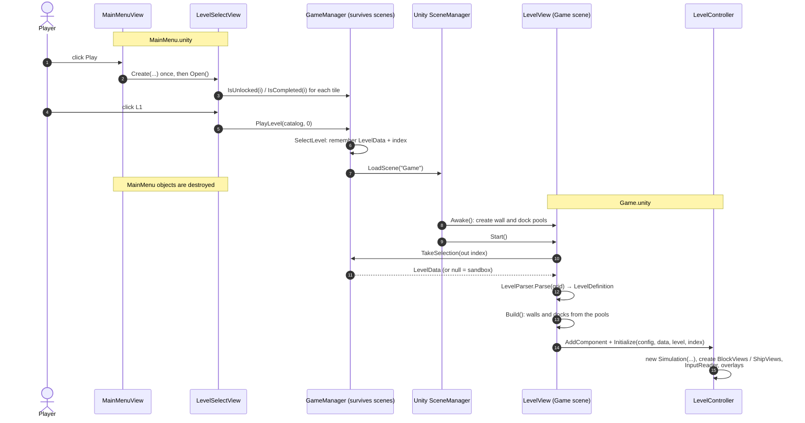
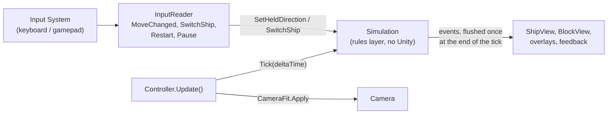
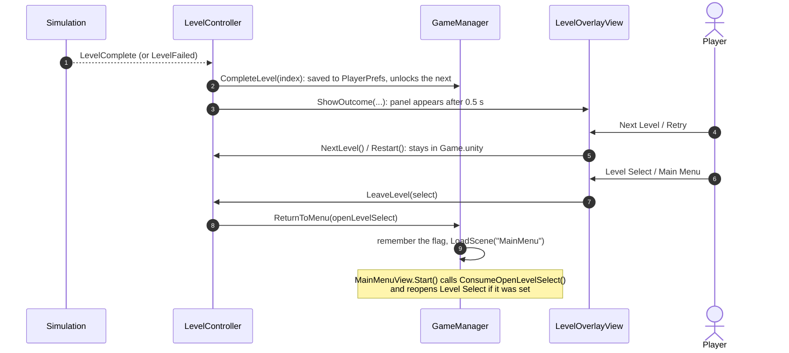

# Game Flow: From the Menu to a Running Level

How the code gets from "player clicks L1" to a level on screen, what runs every frame, and how a level
ends. For what happens inside **one move**, see [`move-flow.md`](move-flow.md). For the rules themselves,
see [GDD §3](GDD.md#3-core-game-loop).

> Describes the code as of issue #18 (`GameManager`, and `LevelController`, which was called
> `SandboxPreviewController` before).

## The short answer

`LevelSelectView` never calls `LevelView`, and it cannot: they live in **different scenes**. When the Game
scene loads, every object of the MainMenu scene is destroyed, including `LevelSelectView`.

The only thing that survives is **`GameManager`** (a `DontDestroyOnLoad` singleton). So the handoff is:

1. `LevelSelectView` tells `GameManager` which level was chosen, and `GameManager` loads the Game scene.
2. Unity creates the Game scene. `LevelView` is an object in that scene, so Unity calls its `Start()`.
3. `LevelView.Start()` asks `GameManager` "which level?" and builds it.

Nobody calls `LevelView`. **Unity** does, because the scene it belongs to was loaded.

## 1. Menu to level

Notes:

- **Sandbox button:** `GameManager.PlaySandbox()` clears the selection and loads the same scene.
  `TakeSelection` then returns null, and `LevelView` falls back to its `previewLevel` (L0_Sandbox).
- **`TakeSelection` hands the level over once.** A second call returns null. This stops a stale selection
  from leaking into a later scene load.
- **A locked or missing level is refused** inside `SelectLevel`, so no caller can skip the unlock rule.

## 2. Every frame while playing

`LevelController.Update()` is the heartbeat. The rules never run on their own; the controller
ticks them.

Inside one `Simulation.Tick`, the steps always run in the same order (GDD §3):

| # | Step | Class |
|---|---|---|
| 1 | Gravity: unsupported blocks fall one cell | `GravitySystem` |
| 2 | The active ship moves: push, lift, carry, release | `MoveResolver` |
| 3 | Which blocks are carried | `CarryTracker` |
| 4 | Ship loads and crush countdowns | `LoadTracker` |
| 5 | Crushes cost a life; ghosts respawn | `LivesAndRespawn` |
| 6 | Oxygen ticks down | `CountdownTimer` |
| 7 | Failure check (no lives, or no oxygen) | `Simulation` |
| 8 | Success check (both ships docked) | `WinChecker` |

Then the events are sent. Views only listen (`ShipMoved`, `ShipCrushed`, `LevelComplete`, ...) and animate.
They never decide whether something is allowed. That is collaboration rule R7.

## 3. Restart, respawn and Next Level: no scene load

None of these go through `GameManager`, and none reload the scene.

| Action | What happens |
|---|---|
| **Respawn** after a crush | Inside the rules (step 5). The ship's position changes; `ShipView` hears `ShipRespawned` and snaps there. |
| **Restart** / **Retry** | `Simulation.Restart()` builds a fresh state from the same `LevelDefinition`. The controller rebinds the existing ship and block views to the new state. |
| **Next Level** | The controller takes the next `LevelData` from the catalog, parses it, calls `LevelView.Build()` (walls and docks return to their pools and are reused), then restarts. |

This is why object pooling matters here: a rebuild creates no new GameObjects once the pools are warm.

## 4. A level ends

`CompleteLevel` is only called for campaign levels (index ≥ 0), so the sandbox never changes progress.

## Who owns what

| Thing | Owner | Lives |
|---|---|---|
| Which level was chosen; "reopen Level Select" flag; every `LoadScene` | `GameManager` | Across scenes |
| Unlock progress on disk | `LevelProgress` (PlayerPrefs), reached through `GameManager` | Across runs of the game |
| Walls and dock pads | `LevelView` + `ObjectPool` | Game scene |
| The rules state (ships, blocks, lives, oxygen) | `Simulation` | One level attempt; rebuilt on Restart |
| Ticking the rules, input wiring, block and ship views | `LevelController` | Game scene |
| Pause / Failed / Complete panels | `LevelOverlayView` | Game scene |
| Camera size and position | `CameraFit` (called by the controller each frame) | Game scene |

## Where to look when something breaks

| Symptom | Start here |
|---|---|
| Wrong level loads, or the sandbox loads instead | `GameManager.SelectLevel` / `TakeSelection`, then `LevelView.Start` |
| A level tile is locked or unlocked wrongly | `LevelProgress.IsUnlocked`, `LevelSelectView.Open` |
| A move is refused or allowed wrongly | `MoveResolver` (rules), never a view |
| A sprite is in the wrong place | The view that listens to that event (`ShipView`, `BlockView`) |
| Something is left over after Restart | `LevelController.Restart`, `Simulation.Restart` |
| The level is cut off or tiny on some screen | `CameraFit.OrthographicSize` |
