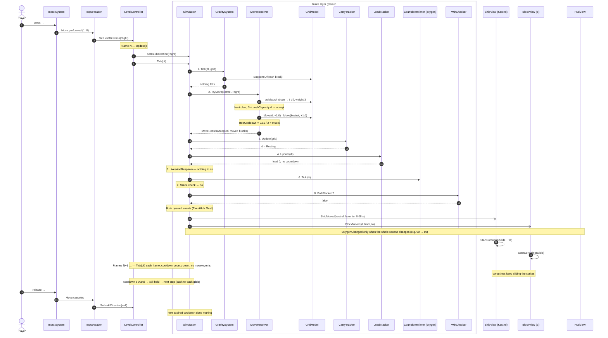

# One Move, End to End

How a single held-direction move travels through the two layers described in
[GDD §7](GDD.md#7-technical-design). Use it as a map when implementing `InputReader`, `LevelController`,
`Simulation`, `MoveResolver` and the views.

> Some details below are not decided in the GDD yet. They are marked **[open]** and listed at the end.

## Scenario

Kestrel is active. A 3-cell teal L-block `d` stands on the floor directly to its right. The player
holds **→**.

```
before                 after one step
. . . . . . .          . . . . . . .
K K d d . . .          . K K d d . .
K K d . . . .          . K K d . . .
# # # # # # #          # # # # # # #
```

## Sequence



## Branches of the same flow

**Refused push** — if `d` weighed 5, `MoveResolver` changes nothing in the grid and the Simulation raises
`MoveRefused(kestrel, Right, TooHeavy, chain, Yellow)`: `ShipView` plays a bump, each `BlockView` in the chain
flashes the chain's colour class. Holding → keeps retrying silently; after `refusalHintSeconds` the Simulation
raises `RefusalHint` and the HUD shows a hint.

**Pushed off a ledge** — the push succeeds this tick. On the next tick, gravity (step 1) finds
`SupportsOf(d)` empty and starts its fall timer. Every `fallStepSeconds` it raises `BlockFell` (the view
slides it one cell down), then `BlockLanded`. Gravity runs before the ship move, so a falling block
beats a ship entering the same cell on the same tick.

## Who owns what

| Concern | Lives in | Why |
|---|---|---|
| Which key means "Move" | Input System action map | Device-independent; code only knows action names |
| Held direction → command | `InputReader` | The only place that touches input |
| Calling `Tick`, pausing | `LevelController` | The one bridge from Unity's frame loop into the rules |
| Step cooldown, fall timer | Rules layer | They decide races (ship vs. falling block), so they must be testable |
| Grid positions | `GridModel` | Changes the moment a step starts |
| Sliding, tilt, bump, flash | Views (coroutines) | Presentation only — a laggy slide can't change the outcome |

## Open questions

Questions 1–4 were decided in the #3 pair session (see the issue comment and GDD §7).

1. ~~**Event delivery**~~ — **queued, flushed once after step 8** (`EventHub`). Views never see a half-updated grid.
2. ~~**Step cooldown location**~~ — **per-ship state in the Simulation.** Use an accumulator
   (`timer -= stepSeconds`, not `= 0`) so ship speed doesn't depend on frame rate.
3. ~~**Sub-frame taps**~~ — **latched in the Simulation, not `InputReader`**: pressing a direction sets a
   "pressed since last step" flag that the next step consumes, even if the key was already released.
4. ~~**`ShipMoved` payload**~~ — **carries `stepSeconds`**; views never read ship speed from config.
5. ~~**Refused move and cooldown**~~ — **decided in #7:** a refusal uses up the step like a move, but only the
   first refusal of a hold raises `MoveRefused` (one bump); later retries are silent and succeed if the obstacle
   clears. After `refusalHintSeconds` of pushing, `RefusalHint` is raised once. Original question: — does a bump start a cooldown? Decides whether holding → against a wall
   bumps once or repeatedly.
